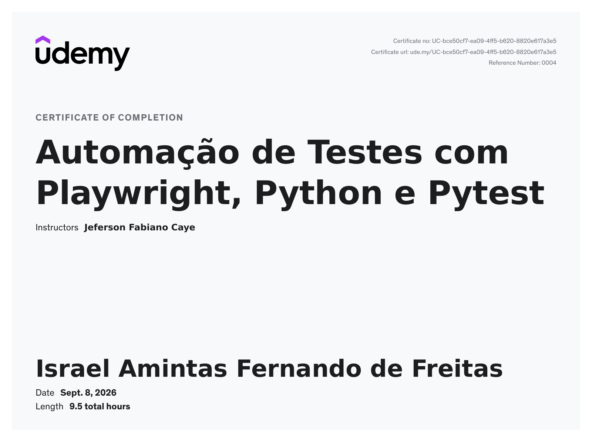

Curso da Udemy: [Automação de Testes com Playwright, Python e Pytest](https://www.udemy.com/course/automacao-de-testes-com-playwright-python-e-pytest/?couponCode=KEEPLEARNING)

## Progresso

- [X] Módulo 1 - Setup e Primeiros Passos
- [X] Módulo 2 - Extra - Python Básico
- [x] Módulo 3 - Fundamentos do Playwright
- [x] Módulo 4 - Page Object Model (POM)
- [x] Módulo 5 - Pytest Fixtures
- [x] Módulo 6 - Exercícios e Boas Práticas
- [x] Módulo 7 - Uploads e Downloads de Arquivos
- [x] Módulo 8 - Extra - Trabalhando com iFrames
- [x] Módulo 9 - Extra - Lógica Condicional Aplicada em Testes com Playwright
- [x] Módulo 10 - Extra - Manipulação de Múltiplas Janelas e Abas
- [x] Módulo 11 - Execução Avançada e Relatórios
- [x] Módulo 12 - Autenticação
- [x] Módulo 13 - Integração Contínua
- [x] Módulo 14 - Extra - Utilitários
- [x] Módulo 15 - Extra - Usando IA nos Testes
- [x] Módulo 16 - Extra - Interceptação, Mock e Controle de Requisições
- [x] Módulo 17 - Conclusão
- [x] Módulo 18 - Bonus: Continue Aprendendo

## Tecnologias

Python, Playwright, Pytest

## Observações
)
