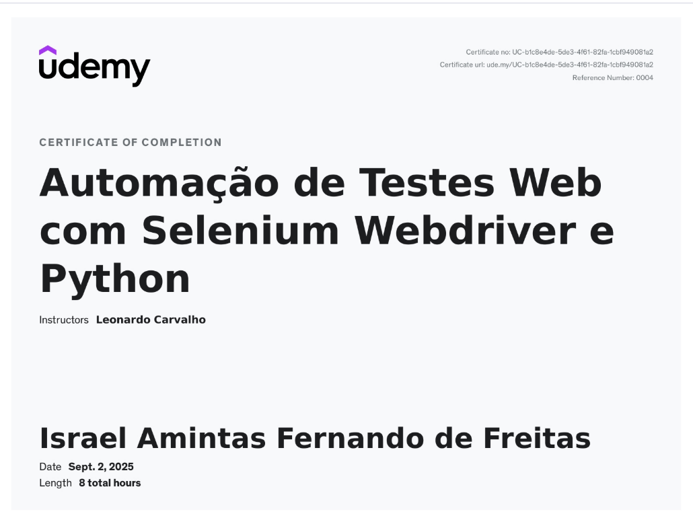

Curso da Udemy: [Selenium WebDriver com Python][(https://www.udemy.com/course/automacao-de-testes-selenium-webdriver-python/?couponCode=MT260902G1B)]

## Progresso
- [x] Módulo 1 - Introdução
- [x] Módulo 3 - element-mapping
- [x] Módulo 4 - selenium-webdriver-commands
- [x] Módulo 5 - first-tests
- [x] Módulo 6 - pytest-basics
- [x] Módulo 7 - page-objects-pattern
- [x] Módulo 7 - framework-functions
- [x] Módulo 8 - debugging-pytest
- [x] Módulo 9 - troubleshooting

## Tecnologias
Python, Selenium WebDriver, Pytest

## Observações

